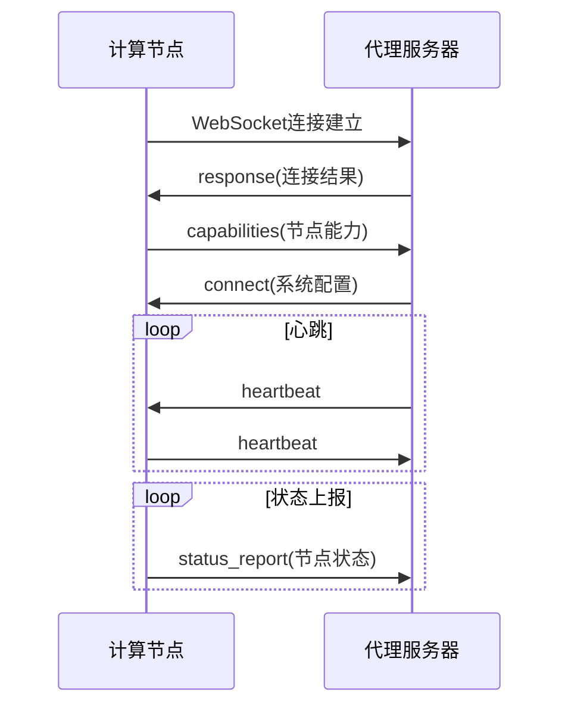
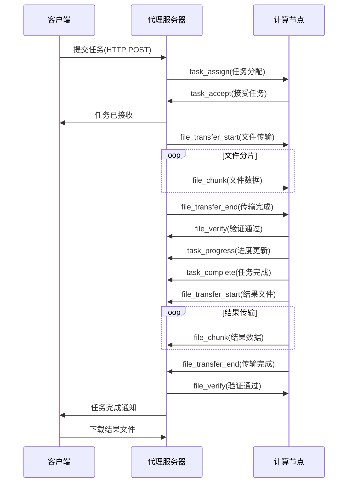

# RAMGEO分布式计算系统WebSocket版本需求文档

## 1. 项目概述

### 1.1 项目背景
RAMGEO（Range-dependent Acoustic Model）是一个用于声学建模的科学计算程序，广泛应用于海洋声学研究和军事声呐系统设计。随着计算需求的增长，单节点计算已无法满足大规模并行处理的需求，需要构建一个分布式的计算管理系统。

### 1.2 项目目标
构建一个基于WebSocket的分布式RAMGEO计算管理系统，实现：
1. 统一的任务提交入口
2. 实时的节点状态监控
3. 自动的负载均衡处理任务
4. 高效的文件传输机制

## 2. 系统架构

### 2.1 整体架构图
```
┌─────────────────────────────────────────────────────┐
│                   客户端层                          │
│                ┌─────────────┐                      │
│                │   API集成   │                      │
│                └─────────────┘                      │
└─────────────────────────────────────────────────────┘
                       │ HTTP
┌─────────────────────────────────────────────────────┐
│                   代理服务器层                       │
│  ┌───────────────────────────────────────────────┐  │
│  │            分布式任务管理器                    │  │
│  │  ┌─────────┐  ┌─────────┐  ┌─────────┐        │  │
│  │  │ 任务调度│  │ 负载均衡 │  │ 状态监控│        │  │
│  │  └─────────┘  └─────────┘  └─────────┘        │  │
│  └───────────────────────────────────────────────┘  │
│                   │ WebSocket                        │
└─────────────────────────────────────────────────────┘
                    │ WebSocket
┌─────────────────────────────────────────────────────┐
│                   计算节点层                         │
│  ┌─────────────┐  ┌─────────────┐  ┌─────────────┐ │
│  │  节点1      │  │  节点2       │  │  节点N      │ │
│  │ ┌─────────┐ │  │ ┌─────────┐ │  │ ┌─────────┐ │ │
│  │ │WebSocket│ │  │ │WebSocket│ │  │ │WebSocket│ │ │
│  │ │ 服务器  │ │  │ │ 服务器   │ │  │ │ 服务器  │ │ │
│  │ └─────────┘ │  │ └─────────┘ │  │ └─────────┘ │ │
│  │ ┌─────────┐ │  │ ┌─────────┐ │  │ ┌─────────┐ │ │
│  │ │ RAMGEO  │ │  │ │ RAMGEO  │ │  │ │ RAMGEO  │ │ │
│  │ │ 计算引擎│ │  │ │ 计算引擎 │ │  │ │ 计算引擎│ │ │
│  │ └─────────┘ │  │ └─────────┘ │  │ └─────────┘ │ │
│  └─────────────┘  └─────────────┘  └─────────────┘ │
└─────────────────────────────────────────────────────┘
```

### 2.2 组件说明
1. **客户端层**：提供api访问方式
2. **代理服务器层**：统一入口和任务调度中心
3. **计算节点层**：实际执行RAMGEO计算的服务器

### 2.3 开发说明
1. 全部采用python实现
2. 节点服务器每个任务分别创建目录来调用/usr/sbin/ramgeo的执行文件来运行计算，该执行文件会读取运行目录下的ramgeo.in的文件，运行结束会生成tl.grid和tl.line两个结果文件

## 3. 功能需求

### 3.1 代理服务器功能

#### 3.1.1 节点管理
| 功能ID | 功能名称 | 详细描述 | 优先级 |
|--------|----------|----------|--------|
| NM001 | 节点注册 | 节点通过WebSocket连接到代理服务器并注册 | P0 |
| NM002 | 心跳监测 | 定期检测节点在线状态 | P0 |
| NM003 | 能力上报 | 节点上报计算能力和资源状态 | P1 |
| NM004 | 动态上线 | 支持节点运行时动态加入集群 | P1 |
| NM005 | 优雅下线 | 节点下线前完成当前任务 | P1 |

#### 3.1.2 任务调度
| 功能ID | 功能名称 | 详细描述 | 优先级 |
|--------|----------|----------|--------|
| TS001 | 任务接收 | 接收客户端提交的计算任务 | P0 |
| TS002 | 负载均衡 | 根据节点负载分配任务 | P0 |
| TS003 | 任务队列 | 管理待执行任务队列 | P0 |
| TS004 | 优先级调度 | 支持任务优先级设置 | P1 |
| TS005 | 依赖调度 | 支持任务间依赖关系 | P2 |
| TS006 | 抢占调度 | 高优先级任务可抢占低优先级任务 | P2 |

#### 3.1.3 文件管理
| 功能ID | 功能名称 | 详细描述 | 优先级 |
|--------|----------|----------|--------|
| FM001 | 文件接收 | 接收客户端上传的输入文件 | P0 |
| FM002 | 文件分发 | 将输入文件分发到计算节点 | P0 |
| FM003 | 结果收集 | 收集计算节点的输出文件 | P0 |
| FM004 | 断点续传 | 支持大文件的断点续传 | P2 |
| FM005 | 文件压缩 | 传输前自动压缩文件 | P2 |

#### 3.1.4 监控统计
| 功能ID | 功能名称 | 详细描述 | 优先级 |
|--------|----------|----------|--------|
| MS001 | 实时监控 | 实时显示系统运行状态 | P0 |
| MS002 | 任务统计 | 统计任务执行情况 | P1 |
| MS003 | 性能分析 | 分析系统性能瓶颈 | P1 |
| MS004 | 告警系统 | 异常情况自动告警 | P1 |
| MS005 | 报表生成 | 生成系统运行报表 | P2 |
| MS006 | 日志管理 | 统一的日志记录和查询 | P0 |

### 3.2 计算节点功能

#### 3.2.1 通信接口
| 功能ID | 功能名称 | 详细描述 | 优先级 |
|--------|----------|----------|--------|
| CI001 | WebSocket服务 | 提供WebSocket通信接口 | P0 |
| CI002 | 心跳响应 | 响应代理服务器的心跳检测 | P0 |
| CI003 | 状态上报 | 定期上报节点状态 | P0 |
| CI004 | 任务接收 | 接收代理服务器分配的任务 | P0 |
| CI005 | 进度上报 | 实时上报任务执行进度 | P1 |
| CI006 | 结果回传 | 任务完成后回传结果 | P0 |

#### 3.2.2 计算管理
| 功能ID | 功能名称 | 详细描述 | 优先级 |
|--------|----------|----------|--------|
| CM001 | 任务执行 | 执行RAMGEO计算任务 | P0 |
| CM002 | 资源监控 | 监控本地CPU、内存、磁盘使用情况 | P1 |
| CM003 | 进程管理 | 管理RAMGEO计算进程 | P0 |
| CM004 | 容错处理 | 处理计算过程中的异常 | P1 |
| CM005 | 并发控制 | 控制并发任务数量 | P0 |

#### 3.2.3 文件处理
| 功能ID | 功能名称 | 详细描述 | 优先级 |
|--------|----------|----------|--------|
| FP001 | 文件接收 | 接收代理服务器发送的输入文件 | P0 |
| FP002 | 结果打包 | 将计算结果打包 | P1 |
| FP003 | 磁盘监控 | 监控磁盘使用情况 | P2 |

### 3.3 客户端功能

#### 3.3.2 API接口
| 功能ID | 功能名称 | 详细描述 | 优先级 |
|--------|----------|----------|--------|
| API001 | REST API | 提供完整的RESTful API | P0 |
| API003 | Webhook | 支持任务完成回调 | P2 |

## 4. WebSocket协议规范

### 4.1 消息格式
```json
{
  "type": "消息类型",
  "id": "消息ID",
  "timestamp": "时间戳",
  "data": {
    // 消息数据
  },
  "metadata": {
    // 元数据
  }
}
```

### 4.3 通信流程

#### 4.3.1 节点注册流程


#### 4.3.2 任务执行流程


## 5. 数据模型

### 5.1 节点数据模型
```yaml
Node:
  id: string            # 节点ID
  name: string          # 节点名称
  status: enum          # 状态: online/offline/busy
  capabilities:
    ramgeo_version: string
    max_concurrent_tasks: integer
    max_file_size: integer
    supported_formats: array
  resources:
    cpu_cores: integer
    memory_gb: integer
    disk_gb: integer
  metrics:
    cpu_usage: float
    memory_usage: float
    disk_usage: float
    active_tasks: integer
  connection:
    ws_url: string
    last_heartbeat: timestamp
    uptime: integer
  metadata:
    location: string
    description: string
    tags: array
```

### 5.2 任务数据模型
```yaml
Task:
  id: string            # 任务ID
  user_id: string       # 用户ID
  status: enum          # 状态: pending/running/completed/failed
  priority: integer     # 优先级
  input_files:
    - name: string
      size: integer
      checksum: string
  output_files:
    - name: string
      size: integer
      checksum: string
  parameters:
    ramgeo_config: object
    timeout: integer
  node_id: string       # 执行节点
  timestamps:
    created_at: timestamp
    started_at: timestamp
    completed_at: timestamp
  metrics:
    execution_time: integer
    cpu_time: integer
    memory_peak: integer
  error_info:
    code: string
    message: string
    stack_trace: string
```

### 5.3 系统配置模型
```yaml
SystemConfig:
  general:
    system_name: string
    version: string
    environment: string
  websocket:
    port: integer
    max_connections: integer
    heartbeat_interval: integer
    timeout: integer
  load_balancing:
    strategy: string    # random/round_robin/least_connections
    weights: object
  file_transfer:
    chunk_size: integer
    compression: boolean
    encryption: boolean
  security:
    auth_enabled: boolean
    ssl_enabled: boolean
    allowed_origins: array
  monitoring:
    metrics_enabled: boolean
    log_level: string
    retention_days: integer
```

## 6. 接口定义

### 6.1 REST API接口

#### 6.1.1 任务管理接口
```http
# 提交任务
POST /api/v1/tasks
Content-Type: multipart/form-data

# 获取任务列表
GET /api/v1/tasks
Query: status, user_id, limit, offset

# 获取任务详情
GET /api/v1/tasks/{task_id}

# 取消任务
DELETE /api/v1/tasks/{task_id}

# 下载结果文件
GET /api/v1/tasks/{task_id}/files/{filename}
```

#### 6.1.2 系统管理接口
```http
# 获取节点列表
GET /api/v1/nodes

# 获取节点详情
GET /api/v1/nodes/{node_id}

# 获取系统状态
GET /api/v1/system/status

# 获取系统指标
GET /api/v1/system/metrics

# 获取系统日志
GET /api/v1/system/logs
Query: level, start_time, end_time
```

### 6.2 WebSocket接口

#### 6.2.1 代理服务器WebSocket接口
```javascript
// 连接地址
ws://{proxy_host}:{websocket_port}/ws

// 消息格式
{
  "type": "message_type",
  "id": "unique_id",
  "timestamp": "2023-12-01T10:00:00Z",
  "data": {},
  "metadata": {}
}
```

#### 6.2.2 计算节点WebSocket接口
```javascript
// 连接地址
ws://{node_host}:{node_ws_port}/node/ws

// 认证消息
{
  "type": "auth",
  "data": {
    "node_id": "node_001",
    "token": "secure_token",
    "capabilities": {
      "ramgeo_version": "1.5",
      "max_tasks": 10
    }
  }
}
```

## 8. 部署架构

### 8.1 单机部署架构
```
┌─────────────────────────────────┐
│         单机部署                │
│  ┌───────────────────────────┐  │
│  │       代理服务器          │  │
│  │  ┌─────────┐ ┌─────────┐ │  │
│  │  │ Web服务 │ │WebSocket│ │  │
│  │  └─────────┘ └─────────┘ │  │
│  │  ┌─────────────────────┐  │  │
│  │  │     计算节点        │  │  │
│  │  │  ┌───────────────┐  │  │  │
│  │  │  │ WebSocket服务 │  │  │  │
│  │  │  └───────────────┘  │  │  │
│  │  │  ┌───────────────┐  │  │  │
│  │  │  │ RAMGEO引擎    │  │  │  │
│  │  │  └───────────────┘  │  │  │
│  │  └─────────────────────┘  │  │
│  └───────────────────────────┘  │
└─────────────────────────────────┘
```

### 8.2 集群部署架构
```
┌─────────────────────────────────────────────────┐
│               负载均衡器                        │
│              (Nginx/Haproxy)                   │
└───────────────┬─────────────────┬───────────────┘
                │                 │
    ┌───────────▼─────┐ ┌─────────▼──────────┐
    │   代理服务器1    │ │    代理服务器2     │
    │  ┌───────────┐  │ │  ┌───────────┐    │
    │  │ Web服务   │  │ │  │ Web服务   │    │
    │  │WebSocket  │  │ │  │WebSocket  │    │
    │  └───────────┘  │ │  └───────────┘    │
    └───────────┬─────┘ └─────────┬─────────┘
                │                 │
        ┌───────┴─────────────────┴───────┐
        │         共享存储                 │
        │      (Redis)         │
        └───────┬─────────────────┬───────┘
                │                 │
    ┌───────────▼─────┐ ┌─────────▼──────────┐
    │   计算节点1     │ │    计算节点2      │
    │  ┌───────────┐  │ │  ┌───────────┐    │
    │  │WebSocket  │  │ │  │WebSocket  │    │
    │  │ RAMGEO    │  │ │  │ RAMGEO    │    │
    │  └───────────┘  │ │  └───────────┘    │
    └─────────────────┘ └───────────────────┘
```

### 8.3 高可用部署架构
```
┌─────────────────────────────────────────────────┐
│             高可用负载均衡集群                   │
│           (Keepalived + Nginx)                  │
└───────────────┬─────────────────┬───────────────┘
                │                 │
    ┌───────────▼─────┐ ┌─────────▼──────────┐
    │  代理服务器主    │ │  代理服务器备      │
    │  ┌───────────┐  │ │  ┌───────────┐    │
    │  │ Web服务   │  │ │  │ Web服务   │    │
    │  │WebSocket  │◄─┼─┼─►│WebSocket  │    │
    │  │  主从同步  │  │ │  │  主从同步  │    │
    │  └───────────┘  │ │  └───────────┘    │
    └───────────┬─────┘ └─────────┬─────────┘
                │                 │
        ┌───────┴─────────────────┴───────┐
        │        高可用数据库              │
        │    (PostgreSQL主从复制)          │
        │    (Redis哨兵模式)               │
        └───────┬─────────────────┬───────┘
                │                 │
    ┌───────────▼─────┐ ┌─────────▼──────────┐
    │   计算节点池    │ │    计算节点池      │
    │  ┌───────────┐  │ │  ┌───────────┐    │
    │  │WebSocket  │  │ │  │WebSocket  │    │
    │  │ RAMGEO    │  │ │  │ RAMGEO    │    │
    │  └───────────┘  │ │  └───────────┘    │
    └─────────────────┘ └───────────────────┘
```

## 9. 监控和运维

### 9.1 监控指标

#### 9.1.1 系统级指标
```yaml
system:
  uptime: 系统运行时间
  cpu_usage: CPU使用率
  memory_usage: 内存使用率
  disk_usage: 磁盘使用率
  network_io: 网络IO
  connections: 连接数
```

#### 9.1.2 服务级指标
```yaml
websocket_service:
  active_connections: 活跃连接数
  messages_per_second: 消息速率
  connection_errors: 连接错误数
  message_queue_size: 消息队列大小

http_service:
  request_rate: 请求速率
  response_time: 响应时间
  error_rate: 错误率
  active_sessions: 活跃会话数
```

#### 9.1.3 业务级指标
```yaml
tasks:
  submitted: 已提交任务数
  running: 运行中任务数
  completed: 已完成任务数
  failed: 失败任务数
  avg_execution_time: 平均执行时间

nodes:
  available: 可用节点数
  busy: 繁忙节点数
  offline: 离线节点数
  avg_load: 平均负载
```

### 9.2 告警规则
| 告警级别 | 触发条件 | 通知方式 | 响应时间 |
|----------|----------|----------|----------|
| 紧急 | 所有节点离线 | 邮件 | 5分钟内 |
| 严重 | 超过50%节点离线 | 邮件 | 15分钟内 |
| 警告 | 单个节点连续故障 | 邮件 | 30分钟内 |
| 提示 | 磁盘使用率>80% | 邮件 | 1小时内 |
| 信息 | 任务失败率>5% | 邮件 | 2小时内 |

### 9.3 日志管理
```yaml
logging:
  levels:
    websocket: INFO
    http: INFO
    task: DEBUG
    system: INFO
    security: WARNING
  
  rotation:
    size: 100MB
    backup_count: 10
    compression: true
  
  output:
    console: true
    file: true
    syslog: false
    
  format: json
```

## 10. 测试策略

### 10.1 单元测试
| 测试类型 | 覆盖率要求 | 测试工具 |
|----------|------------|----------|
| 业务逻辑 | ≥90% | pytest |
| 数据模型 | ≥95% | pytest |
| 工具函数 | ≥95% | pytest |
| API接口 | ≥85% | pytest, requests |

### 10.2 集成测试
| 测试场景 | 测试内容 | 通过标准 |
|----------|----------|----------|
| 节点注册 | 节点成功注册到代理 | 认证通过，状态正常 |
| 任务提交 | 任务成功分配到节点 | 任务状态正常流转 |
| 文件传输 | 大文件成功传输 | 文件完整性验证 |
| 故障恢复 | 节点故障自动转移 | 任务成功恢复 |
| 负载均衡 | 多节点负载均衡 | 负载分布合理 |

### 10.3 性能测试
| 测试场景 | 并发用户 | 预期指标 |
|----------|----------|----------|
| 单任务提交 | 1 | 响应时间<5s |
| 批量任务提交 | 100 | 吞吐量>50任务/秒 |
| 大文件传输 | 10 | 传输速度>50MB/s |
| 高并发访问 | 1000 | 系统稳定运行 |
| 长时间运行 | 24小时 | 无内存泄漏 |

### 10.4 安全测试
| 测试类型 | 测试内容 | 通过标准 |
|----------|----------|----------|
| 认证测试 | 无效token访问 | 拒绝访问 |
| 授权测试 | 越权操作 | 权限拒绝 |
| 注入测试 | SQL/命令注入 | 安全防护 |
| 加密测试 | 数据传输 | 加密有效 |
| 漏洞扫描 | 已知漏洞 | 无高危漏洞 |

## 11. 上线计划

### 11.1 第一阶段（V1.0） - 基础功能
| 时间 | 里程碑 | 交付物 |
|------|--------|--------|
| 第1周 | 项目启动 | 详细设计文档 |
| 第2-3周 | 代理服务器开发 | 代理服务器代码 |
| 第4-5周 | 计算节点开发 | 节点服务代码 |
| 第6周 | Web界面开发 | 管理界面 |
| 第7周 | 集成测试 | 测试报告 |
| 第8周 | 部署上线 | 生产环境 |

### 11.2 第二阶段（V1.1） - 增强功能
| 时间 | 里程碑 | 交付物 |
|------|--------|--------|
| 第9-10周 | 高可用架构 | 集群部署方案 |
| 第11-12周 | 监控系统 | 监控告警系统 |
| 第13-14周 | API完善 | 完整API文档 |
| 第15-16周 | 性能优化 | 性能测试报告 |

### 11.3 第三阶段（V2.0） - 高级功能
| 时间 | 里程碑 | 交付物 |
|------|--------|--------|
| 第17-20周 | 任务调度优化 | 智能调度算法 |
| 第21-24周 | 机器学习集成 | 预测性调度 |
| 第25-28周 | 多云支持 | 混合云部署 |
| 第29-32周 | 生态系统建设 | 插件系统 |

## 12. 风险评估与应对

### 12.1 技术风险
| 风险 | 概率 | 影响 | 应对措施 |
|------|------|------|----------|
| WebSocket连接不稳定 | 中 | 高 | 实现重连机制，提供HTTP回退 |
| 大文件传输失败 | 中 | 中 | 实现分片传输和断点续传 |
| 节点资源竞争 | 高 | 中 | 实现资源限制和优先级调度 |
| 内存泄漏 | 低 | 高 | 严格代码审查，定期压力测试 |

### 12.2 运维风险
| 风险 | 概率 | 影响 | 应对措施 |
|------|------|------|----------|
| 节点故障 | 高 | 高 | 实现自动故障转移和恢复 |
| 网络分区 | 中 | 高 | 设计分区容忍机制 |
| 数据丢失 | 低 | 极高 | 实现数据备份和恢复机制 |
| 配置错误 | 中 | 中 | 实现配置验证和回滚机制 |

### 12.3 安全风险
| 风险 | 概率 | 影响 | 应对措施 |
|------|------|------|----------|
| 未授权访问 | 中 | 高 | 实现强身份认证和授权 |
| 数据泄露 | 低 | 极高 | 实现端到端加密 |
| DDoS攻击 | 低 | 高 | 实现流量限制和清洗 |
| 代码漏洞 | 中 | 高 | 定期安全审计和漏洞扫描 |

## 13. 附录

### 13.1 术语表
| 术语 | 定义 |
|------|------|
| RAMGEO | Range-dependent Acoustic Model，声学计算模型 |
| 代理服务器 | 分布式系统的入口和调度中心 |
| 计算节点 | 实际执行RAMGEO计算的服务器 |
| WebSocket | 全双工通信协议，用于实时数据传输 |
| 任务调度 | 将计算任务分配给合适的节点 |
| 负载均衡 | 平衡各节点的计算负载 |

### 13.2 参考文档
1. WebSocket协议规范 RFC 6455
2. RAMGEO用户手册
3. 分布式系统设计原则
4. 微服务架构指南
5. 云计算最佳实践

### 13.3 变更记录
| 版本 | 日期 | 修改内容 | 修改人 |
|------|------|----------|--------|
| V1.0 | 2023-12-01 | 初始版本 | 架构组 |
| V1.1 | 2023-12-05 | 增加部署架构 | 架构组 |
| V2.0 | 2023-12-10 | WebSocket版本需求 | 架构组 |

---

**文档批准**：
- 项目经理：__________________
- 技术负责人：__________________
- 产品负责人：__________________
- 质量保证：__________________

**生效日期**：2023年12月11日